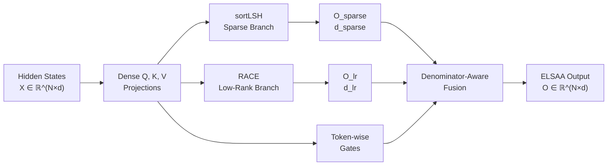

# ELSAA: Efficient Low-Rank and Sparse Attention Approximation

**Combining exact sparse attention with global low-rank context for training long-sequence Transformers efficiently**

<div align="center">

[](https://grigoris.ece.wisc.edu/workshops/colorai-icml-2026/)
[](https://openreview.net/forum?id=2NNK59nNDo)
[](LICENSE)
[](https://www.python.org/downloads/)

**[Paper (OpenReview)](https://openreview.net/forum?id=2NNK59nNDo) · [Workshop](https://grigoris.ece.wisc.edu/workshops/colorai-icml-2026/) · [GitHub](https://github.com/mahdiheidari721/ELSAA)**

</div>

---

## About ELSAA

**ELSAA** is a hybrid attention mechanism that dramatically reduces the computational complexity of training Transformers on long sequences—from 🔴 quadratic **O(N²)** to 🟢 **linear O(N(s + L_s 2^γ))** attention interactions.

By combining:
- **Exact sparse attention** via sorted locality-sensitive hashing (sortLSH)
- **Global low-rank context** via RACE attention
- **Denominator-aware fusion** to intelligently merge the two branches

ELSAA achieves **~99% reduction in attention computations** while maintaining or improving accuracy across text, vision, and synthetic recall tasks at sequence lengths up to **65,536 tokens**.

### Key Achievement
✅ **Needle-in-a-Haystack (NIAH):** Only efficient method to maintain strong performance both *within* training length (1K tokens) and at *65K tokens* context window.

---

## Authors

**Mahdi Heidari¹ · Mohammad Mahdi Rahimi² · Jaekyun Moon¹**

¹ Korea Advanced Institute of Science and Technology (KAIST)  
² Daegu Gyeongbuk Institute of Science and Technology (DGIST)

---

## Why ELSAA?

| Challenge | ELSAA Solution |
|-----------|---|
| **Quadratic complexity** in sequence length | Linear attention interactions for fixed branch budgets |
| **Token-level details** vs. **global context** | Sparse + low-rank branches capture both without materializing full N×N matrix |
| **Normalization mismatch** between branches | Denominator-aware fusion rule calibrates scale automatically |
| **Long-context training** instability | Proven on ArXiv, vision, retrieval, and synthetic tasks up to 65K tokens |

---

## Method Overview



### ELSAA Fusion Equation

For each query token *i*:

$$O_i = g_{\mathrm{sparse},i}\, m_{\mathrm{sparse},i}\, O_{\mathrm{sparse},i} + g_{\mathrm{lr},i}\, O_{\mathrm{lr},i}$$

where the **denominator-aware multiplier** is:

$$m_{\mathrm{sparse},i} = \frac{d_{\mathrm{sparse},i}}{d_{\mathrm{sparse},i} + \lambda_i d_{\mathrm{lr},i} + \varepsilon}$$

**Why this matters:** Sparse and low-rank branches normalize differently. Without `m_sparse`, the branches would be incomparable—ELSAA's fusion rule rescales them to a common scale using their actual normalization mass.

---

## Results Highlights

### 📊 Long-Context Classification (Non-Causal)
Average accuracy across **ArXiv 32K** + three **16K-token vision tasks**:

| Method | Accuracy |
|:---|---:|
| **🏆 ELSAA** | **46.81%** |
| sortLSH + RACE (no correction) | 45.48% |
| ExactFlash | 43.22% |
| RACE alone | 42.67% |

**Denominator-aware fusion gives +1.33% absolute improvement.**

### 📏 Needle-in-Haystack (Length Extrapolation)
Trained at **1K tokens**, tested at **512, 16K, 32K, 64K**:

| Method | 512 | 16K | 32K | 64K |
|:---|---:|---:|---:|---:|
| ExactFlash | 100.0% | 100.0% | OOM | OOM |
| **🏆 ELSAA** | **100.0%** | **100.0%** | **98.8%** | **84.2%** |
| Sparse LSH | 24.6% | 100.0% | 100.0% | 100.0% |
| RACE | 11.0% | 6.4% | 4.8% | 2.2% |

**ELSAA is the *only* efficient method that extrapolates well to 10× training length.**

### 🎯 Causal & Retrieval Tasks

| Task | Metric | Score |
|:---|:---|---:|
| Causal classification (32K & 64K ArXiv) | Avg. accuracy | **72.15%** |
| Long-text retrieval @ 64K tokens | Accuracy | **65.34%** |

---

## Complexity Analysis

For **N** sequence length, **s** sortLSH block budget, **L_s** RACE hash tables, **γ** RACE hash bits:

| Method | Attention Interactions | Scaling |
|:---|---:|:---|
| Dense exact attention | Θ(N²) | Quadratic ❌ |
| sortLSH alone | Θ(Ns) | Linear in s ✅ |
| RACE alone | Θ(NL_s 2^γ) | Linear in hash budget ✅ |
| **ELSAA (hybrid)** | **Θ(N(s + L_s 2^γ))** | **Linear in total budget ✅** |

### Numerical Example: N = 32,000 tokens

With s=256, L_s=4, γ=4:

| Branch | Interactions | Reduction |
|:---|---:|:---|
| Full dense attention | **1.024 × 10⁹** | – |
| sortLSH branch | 8.192 × 10⁶ | 0.8% |
| RACE branch | 2.048 × 10⁶ | 0.2% |
| **ELSAA total** | **1.024 × 10⁷** | **~99%** ✅ |

---

## Components

### 1️⃣ **sortLSH Sparse Branch**
- Queries and keys hashed to buckets
- Fixed-size blocks sorted by hash value
- Compute exact attention **only within selected blocks**
- Preserves high-similarity query-key interactions
- Complexity: **O(Ns)**

### 2️⃣ **RACE Low-Rank Global Branch**
- Hash queries and keys into soft buckets
- Accumulate key/value statistics per bucket
- Each query reads from bucket summaries
- Provides global context without full N×N matrix
- Complexity: **O(NL_s 2^γ)**

### 3️⃣ **Denominator-Aware Fusion**
- Compute normalization mass for each branch
- Calibrate sparse output by relative mass: `m_sparse = d_sparse / (d_sparse + λ·d_lr)`
- Learn token-wise gates for branch balance
- Produce final output: `O = g_sparse · m_sparse · O_sparse + g_lr · O_lr`

### 4️⃣ **Causal Variants** (Optional)
- Chunked cumulative RACE summaries for previous tokens
- Causally masked sortLSH within each chunk
- Recursive log-sum-exp-aware merging

---

## Theoretical Contribution

**Rank Guarantee for Hybrid Sparse-Plus-Low-Rank Attention**

For an operator of the form M = S_Ω + BA (sparse + low-rank):

$$\operatorname{rank}(S_\Omega + BA) = \min\{n, \nu(\Omega) + r\} \quad \text{(almost surely)}$$

where:
- **ν(Ω)** = maximum matching size of the bipartite sparse support graph
- **r** = rank of low-rank component

**Implication:** A sparse component with matching deficiency ≤ r, combined with a rank-r global component, is sufficient for full rank.

---

## Evaluated Tasks

Experiments across **10 datasets**, sequence lengths **512 – 65,536 tokens**:

| Task | Dataset | Mode | Seq Length | Hardware |
|:---|:---|:---|---:|:---|
| Scientific text classification | ArXiv | Non-causal | 32,000 | NVIDIA RTX PRO 6000 Blackwell |
| Text retrieval (pairs) | ArXiv pairs | Non-causal | 64,000 | 48 GB VRAM |
| Associative recall | Needle-in-a-Haystack | Non-causal | 512–65,536 | – |
| Sentiment classification | IMDB | Non-causal | 512 | – |
| Image classification | Fashion-MNIST | Non-causal | 784 | – |
| Fine-grained image classification | Oxford-IIIT Pet | Non-causal | 16,384 | – |
| Fine-grained image classification | Flowers-102 | Non-causal | 16,384 | – |
| Food classification | Food-101 | Non-causal | 16,384 | – |
| Causal text classification | ArXiv | Causal | 32,000, 64,000 | – |
| Causal image classification | Tiny ImageNet | Causal | 1,024 | – |

---

## Installation

### 1. Clone the Repository
```bash
git clone https://github.com/mahdiheidari721/ELSAA.git
cd ELSAA
```

### 2. Create Virtual Environment
```bash
python -m venv .venv
source .venv/bin/activate        # macOS / Linux
# .venv\Scripts\activate         # Windows PowerShell
```

### 3. Install Dependencies
```bash
python -m pip install --upgrade pip
pip install -r requirements.txt
```

**Recommended versions:**
- Python 3.9+
- PyTorch 2.0+
- CUDA 11.8+ (for GPU support)

---

## Quick Start

### Run a Training Script
```bash
python Codes/arxiv.py \
  --attention_type elsaa \
  --seq_length 32000 \
  --sparse_budget 256 \
  --race_hash_tables 4 \
  --race_hash_bits 4
```

### Key Parameters

| Parameter | Default | Meaning |
|:---|---:|:---|
| `--attention_type` | `elsaa` | Attention mechanism (elsaa, race, sortlsh, dense) |
| `--seq_length` | 32000 | Sequence length in tokens |
| `--sparse_budget` | 256 | sortLSH block size (s) |
| `--race_hash_tables` | 4 | Number of RACE hash tables (L_s) |
| `--race_hash_bits` | 4 | Hash bits per table (γ) |
| `--causal` | False | Enable causal attention variant |

### Full Example
```bash
python Codes/arxiv.py \
  --attention_type elsaa \
  --seq_length 64000 \
  --sparse_budget 512 \
  --race_hash_tables 4 \
  --race_hash_bits 4 \
  --causal false \
  --batch_size 8 \
  --learning_rate 1e-4 \
  --epochs 10 \
  --seed 42
```

---

## Repository Structure

```
ELSAA/
├── README.md                          # This file
├── LICENSE                            # MIT License
├── requirements.txt                   # Python dependencies
│
├── Codes/                             # Implementation scripts
│   ├── arxiv.py                       # ArXiv classification (32K)
│   ├── arxiv_64K.py                   # ArXiv classification (64K)
│   ├── Niah.py                        # Needle-in-a-Haystack
│   ├── Causal_vit_tinyimagenet.py     # Causal image classification
│   ├── elsaa_causal_complete.py       # Full causal ELSAA
│   ├── classification.py              # General classification
│   ├── race.py                        # RACE branch implementation
│   ├── race_kernel.py                 # RACE GPU kernels
│   ├── sort_lsh.py                    # sortLSH branch
│   └── [other task-specific scripts]
│
├── experiments/                       # Paper reproduction scripts
│   ├── run_arxiv_32k.sh
│   ├── run_arxiv_64k.sh
│   ├── run_niah.sh
│   └── ...
│
├── configs/                           # Configuration files
│   ├── elsaa_base.yaml
│   ├── arxiv.yaml
│   └── ...
│
└── checkpoints/                       # Model checkpoints (not tracked)
    └── (download from releases)
```

---

## Related Work

- **RACE Attention** ([OpenReview](https://openreview.net/forum?id=RR8Lh8RHgA)): Low-rank approximation via hash-bucket summaries
- **Sparse Attention** (Child et al., 2019): Structured sparsity patterns
- **Flash Attention** (Dao et al., 2022): IO-aware exact attention
- **Performer** (Choromanski et al., 2021): Kernel-based linear attention

ELSAA **combines** sparse and low-rank—neither alone achieves the same performance across diverse tasks.

---

## Citation

Please cite ELSAA if you use it in your research:

```bibtex
@inproceedings{heidari2026elsaa,
  title     = {ELSAA: Efficient Low-Rank and Sparse Attention Approximation for Training Transformers},
  author    = {Heidari, Mahdi and Rahimi, Mohammad Mahdi and Moon, Jaekyun},
  booktitle = {ICML 2026 Workshop on Connecting Low-rank Representations in AI (CoLoRAI)},
  year      = {2026},
  url       = {https://openreview.net/forum?id=2NNK59nNDo}
}
```

---

## Acknowledgements

This work was supported by:

- **National Research Foundation of Korea (NRF)** grants funded by the Korean government (MSIT)
  - RS-2024-00340966
  - RS-2024-00408003

- **Institute for Information & Communications Technology Promotion (IITP)** grant funded by the Korean government (MSIT)
  - RS-2024-00444862

---

## License

This project is licensed under the **MIT License** — see [LICENSE](LICENSE) for details.

---

## Contact & Support

**Questions?** Open a GitHub issue or contact us:

📧 **Mahdi Heidari** — `mahdi.heidari.ee.sut@kaist.ac.kr`

---

## Roadmap

- [ ] Optimized CUDA kernels for sortLSH and RACE branches
- [ ] Large-scale causal language model pretraining
- [ ] Scaling studies (model size, context, depth, modality)
- [ ] Joint parameter + attention space compression
- [ ] Bias/variance analysis of fusion rule
- [ ] Hugging Face integration

---

<div align="center">

**⭐ If ELSAA helps your research, please star the repository!**

[GitHub](https://github.com/mahdiheidari721/ELSAA) · [OpenReview](https://openreview.net/forum?id=2NNK59nNDo) · [Workshop](https://grigoris.ece.wisc.edu/workshops/colorai-icml-2026/)

</div>
